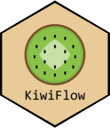

# 

KiwiFlow is a pipeline with graphical and interactive user interface to perform proteomics mass spectrometry data analysis. It implements UniDec's (https://github.com/michaelmarty/UniDec) bayesian mass spectra deconvolution method and provides downstream analyses for protein binding studies.  

[www.liora-bioinformatics.com](https://www.liora-bioinformatics.com) \|
[info\@liora-bioinformatics.com](mailto:info@liora-bioinformatics.com)

*_KiwiFlow is supposed to be used for research and academic purposes only._*

# KiwiFlow Setup and Update Instructions

Follow these steps to set up, update, and launch the application on your Windows system.

### Prerequisites
- **Operating System**: Windows 10 or later.
- **Administrative Privileges**: Required for setup and updates. A UAC prompt will appear.
- **Internet Connection**: Required to download Miniconda, updates, and packages.

### Setup Steps
1. **Download KiwiFlow Source Code**
   - Download the source code from https://github.com/infinity-a11y/KiwiFlow/archive/refs/heads/master.zip
   - Extract the files to a writeable and readable directory e.g., `C:\Users\Admin\Desktop\KiwiFlow`.
2. **Run the Setup**:
   - Navigate to the `KiwiFlow` folder (e.g., `C:\Users\Admin\Desktop\KiwiFlow`).
   - Double-click `setup_kiwiflow.exe` or right-click and select **"Run as administrator"**.
   - A User Account Control (UAC) prompt will appear. Click **"Yes"**.
3. **Monitor Progress**:
   - A PowerShell console window will show setup progress.
   - Check `kiwiflow_setup.log` in the `KiwiFlow` folder for details.
4. **Launch KiwiFlow**:
   - Double-click the `KiwiFlow.lnk` shortcut on your desktop.
   - A popup will appear: “KiwiFlow will open shortly, please wait...”.
   - The Shiny app will open in your default web browser at `http://localhost:3838`.

### Troubleshooting
- **Conda Environment Update Error**:
  - If you see “ERROR conda.cli.main_run:execute(125)” in `kiwiflow_setup.log` or `kiwiflow_update.log`:
    - Check the log for Conda output (e.g., dependency conflicts, unavailable packages).
    - Verify a stable internet connection.
- **Launch Error**: If `KiwiFlow.lnk` fails, check `launch_log.txt` and contact us.
- **No Popup or Browser Launch**: Ensure `app.R` is in the `KiwiFlow` folder and Conda is installed at `C:\Miniconda3`.
- **UAC Prompt Blocked**: Click “Yes” on the UAC prompt. If it doesn’t appear, right-click `setup_kiwiflow.exe` or `update.exe` and select “Run as administrator”.
- **Antivirus Blocks Executable**: If `setup_kiwiflow.exe` or `update.exe` is quarantined, add an exception for the `KiwiFlow` folder and restore the file.
- **Setup/Update Fails**: Check `kiwiflow_setup.log` or `kiwiflow_update.log` for errors. Ensure `environment.yml` and `app.R` are in the `KiwiFlow` folder.
- **Manual Conda Installation**: If Miniconda installation fails, install it manually from [https://docs.conda.io/en/latest/miniconda.html](https://docs.conda.io/en/latest/miniconda.html), then rerun `setup_kiwiflow.exe`.

### Support
For assistance, contact info@liora-bioinformatics.com and provide the logfiles `kiwiflow_setup.log`, `kiwiflow_update.log`.
