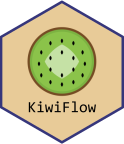

# 

KiwiFlow is an interactive pipeline with graphical user interface to perform proteomics mass spectrometry data analysis. It implements UniDec's (https://github.com/michaelmarty/UniDec) bayesian mass spectra deconvolution method and provides downstream analyses for protein binding studies.  

[www.liora-bioinformatics.com](https://www.liora-bioinformatics.com) \|
[info\@liora-bioinformatics.com](mailto:info@liora-bioinformatics.com)

*_KiwiFlow is supposed to be used for research and academic purposes only._*

# Installation

Follow these steps to set up and launch the application on your Windows system.

### Prerequisites
- **Operating System**: Windows 10 or later.
- **Browser**: KiwiFlow is running in the default browser. 
- **Administrative Privileges**: Required for setup and updates. A UAC prompt will appear.
- **Internet Connection**: Required to download Miniconda, updates, and packages.
